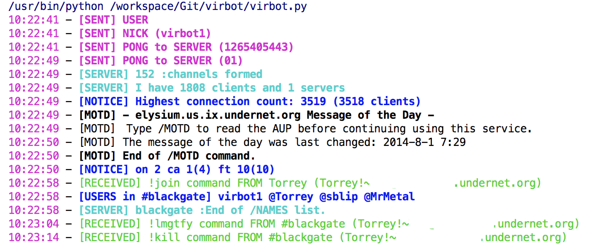

# virbot

This script was created to serve as a starting template of a dynamic irc bot that can be easily configured and have commands and functionality added with very little effort.

## Requirements

This script makes use of the [*hues*](https://pypi.org/project/hues/) library, which has been added to the *requirements.txt* file so you can install it by simply running the following command.

    pip install -r requirements.txt
    
## Configuration

The default configuration for this script can be found in the *config.json* file and looks like this.

    {
      "nickname" : "virbot1",
      "realname" : "Channel Bot",
      "channel" : "#blackgate",
      "server" : {
        "name" : "us.undernet.org",
        "port" : 6667
      },
      "debugmode" : false,
      "botcommands" : {
        "!host" : "host_command",
        "!join" : "join_command",
        "!kill" : "kill_command",
        "!lmgtfy" : "lmgtfy_command",
        "!part" : "part_command",
        "!op!" : "op_command"
      },
      "irccommands" : {
        "join" : "JOIN {0}\n",
        "part" : "PART {0}\n",
        "nick" : "NICK {0}\n",
        "pong" : "PONG {0}\n",
        "privmsg" : "PRIVMSG {0} :{1}\n",
        "quit" : "QUIT :{0}\n",
        "user" : "USER {0} {1} {2} :{3}\n",
        "op" : "MODE {0} +o {1}\n"
      },
      "numerics" : {
        "332" : "numeric_332",
        "333" : "numeric_333",
        "353" : "numeric_353",
        "372" : "numeric_372",
        "375" : "numeric_375",
        "376" : "numeric_376"
      },
      "strings" :{
        "quitmessage" : "Bot Terminated",
        "useragent" : "Mozilla/5.0 (Macintosh; Intel Mac OS X 10_9_5) AppleWebKit 537.36 (KHTML, like Gecko) Chrome"
      }
    }
    
### **nickname, realname, channel and server**

The first four elements of the json; **nickname**, **realname**, **channel** and **server** are the basic requirements for a client/bot to connect to an irc server. *It is important to note that the bot's source has been updated to no longer join the channel from the configuration. If you'd like to have it join a channel upon connection, you'll need to issue the command in the proper numerics method.*

### **debugmode**

The **debugmode** key when set to *true* allows you to see all messages received from the server in their raw format. This is really useful when you want to see how different irc servers for various messages and numerics to help you extend the bot's capabilities.

### **botcommands**

The **botcommands** object uses the format of: 

    command name (as used from irc) : method name (which gets added to commands.py)

When the bot receives a chat message from the server it gets passed to the *process_botcommand* method in commands.py. This method checks if the text received matches the input, and if it does, it'll find the matching configured method name from the class and calls it.

The method declaration in *commands.py* is as follows and should be used for any commands you want to add.

    def your_command(self, requester, message):
    
The *requester* is the nick or channel name that sent the message. The *message* parameter contains the text that came after the command string.

More details to come...

## License

The MIT License

Copyright © 2019 Torrey Betts

Permission is hereby granted, free of charge, to any person obtaining a copy of this software and associated documentation files (the "Software"), to deal in the Software without restriction, including without limitation the rights to use, copy, modify, merge, publish, distribute, sublicense, and/or sell copies of the Software, and to permit persons to whom the Software is furnished to do so, subject to the following conditions:

The above copyright notice and this permission notice shall be included in all copies or substantial portions of the Software.

THE SOFTWARE IS PROVIDED "AS IS", WITHOUT WARRANTY OF ANY KIND, EXPRESS OR IMPLIED, INCLUDING BUT NOT LIMITED TO THE WARRANTIES OF MERCHANTABILITY, FITNESS FOR A PARTICULAR PURPOSE AND NONINFRINGEMENT. IN NO EVENT SHALL THE AUTHORS OR COPYRIGHT HOLDERS BE LIABLE FOR ANY CLAIM, DAMAGES OR OTHER LIABILITY, WHETHER IN AN ACTION OF CONTRACT, TORT OR OTHERWISE, ARISING FROM, OUT OF OR IN CONNECTION WITH THE SOFTWARE OR THE USE OR OTHER DEALINGS IN THE SOFTWARE.
